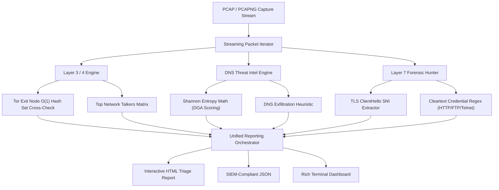

# 🐕 TorHound — PCAP Forensics & Tor Exit-Node Tracker

[](https://python.org)
[](https://github.com/Mr-N1ck/torhound)
[](https://github.com/Textualize/rich)
[](https://attack.mitre.org/techniques/T1090/003/)
[](LICENSE)

An enterprise-grade, lightweight network packet triage and threat hunting tool engineered for **Digital Forensics & Incident Response (DFIR)** specialists, SOC analysts, and CTF competitors.

Processes multi-gigabyte `.pcap` and `.pcapng` capture streams with memory-efficient iterators to detect Tor circuit traversal, algorithmic domain generation (DGA), cleartext credential leaks, TLS SNI destinations, and protocol anomalies in seconds.

---

## ⚡ Key Capabilities

- 🚩 **Tor Exit Node & Dark-Web Correlation:** Real-time $O(1)$ set lookup against an indexed database of 7,900+ verified Tor exit nodes, identifying both inbound relays and outbound covert circuits.
- 🧬 **DNS Threat Intel & DGA Detection:** Computes Shannon entropy ($H(X) = -\sum P(x) \log_2 P(x)$) over DNS query labels to flag automated Domain Generation Algorithms (DGA) and covert DNS data exfiltration tunnels.
- 🚨 **Cleartext Credential Hunter:** Deep-payload regex engine extracting HTTP Basic Auth (`Authorization: Basic`), web form POST password parameters, FTP (`USER`/`PASS`), and Telnet interactions.
- 🔒 **TLS SNI Profiler:** Decodes TLS ClientHello records without breaking encryption to extract target Server Name Indications (SNI) and map direct-IP anomalies.
- 📊 **Traffic & Conversation Analytics:** Computes protocol distributions (IPv4, IPv6, TCP, UDP, DNS, TLS) and ranks top network talkers by conversation density.
- 📄 **Multi-Format Reporting:** Generates interactive **Rich** console dashboards, SIEM-compliant **JSON** artifacts, and self-contained **HTML** triage reports.

---

## 🏗️ Forensic Processing Pipeline



---

## 🎯 MITRE ATT&CK® Mapping

| Technique ID | Tactic | Description | Detection Logic |
| :--- | :--- | :--- | :--- |
| **[T1090.003](https://attack.mitre.org/techniques/T1090/003/)** | Command & Control | Multi-hop Proxy: Tor | Inbound / Outbound IP cross-referencing against Tor consensus database |
| **[T1071.004](https://attack.mitre.org/techniques/T1071/004/)** | Command & Control | Application Layer Protocol: DNS | Shannon entropy analysis ($H \ge 3.8\text{ bits}$) on queried subdomains |
| **[T1552.001](https://attack.mitre.org/techniques/T1552/001/)** | Credential Access | Unsecured Credentials | Payload regex scanning across HTTP POST, Basic Auth, FTP, Telnet streams |
| **[T1571](https://attack.mitre.org/techniques/T1571/)** | Command & Control | Non-Standard Port | Identification of unexpected listener ports (4444, 1337, 31337, 6667) |

---

## 🚀 Quick Start

### Installation
```bash
git clone https://github.com/Mr-N1ck/torhound.git
cd torhound
pip install -r requirements.txt
```

### Usage Examples
```bash
# 1. Interactive triage mode
python3 pcap_analyzer.py

# 2. Automated triage with CLI argument
python3 pcap_analyzer.py capture.pcapng

# 3. Export full SIEM JSON and HTML reports
python3 pcap_analyzer.py tor_user.pcapng --export-json report.json --export-html report.html

# 4. Custom DGA entropy threshold
python3 pcap_analyzer.py capture.pcap -e 3.5
```

---

## 💻 CLI Options

```text
usage: pcap_analyzer.py [-h] [-t TOR_LIST] [-e ENTROPY]
                        [--export-json EXPORT_JSON] [--export-html EXPORT_HTML]
                        [pcap]

options:
  -h, --help            show this help message and exit
  -t TOR_LIST, --tor-list TOR_LIST
                        Path to Tor exit node IP database (default: tor_all_ips.txt)
  -e ENTROPY, --entropy ENTROPY
                        Shannon entropy threshold for DNS DGA (default: 3.8)
  --export-json EXPORT_JSON
                        Save findings as structured JSON for SIEM
  --export-html EXPORT_HTML
                        Generate self-contained interactive HTML report
```

---

## 🎥 Proof of Concept & Artifacts

> **Note:** Sample PCAPs, triage logs, and generated HTML report previews are located in [`docs/`](docs/) and [`poc/`](poc/).

<!-- User Demo Placement Zone -->
```
[ Drop your demo.gif or demo.mp4 recording here: docs/demo.gif ]
```

---

## ⚖️ License & Ethical Policy

Distributed under the MIT License. Developed strictly for authorized digital forensics, CTF competitions, malware traffic analysis, and incident response triage.

**Author:** Prince Gaur ([LinkedIn](https://www.linkedin.com/in/mr-n1ck/) · [GitHub](https://github.com/Mr-N1ck))
